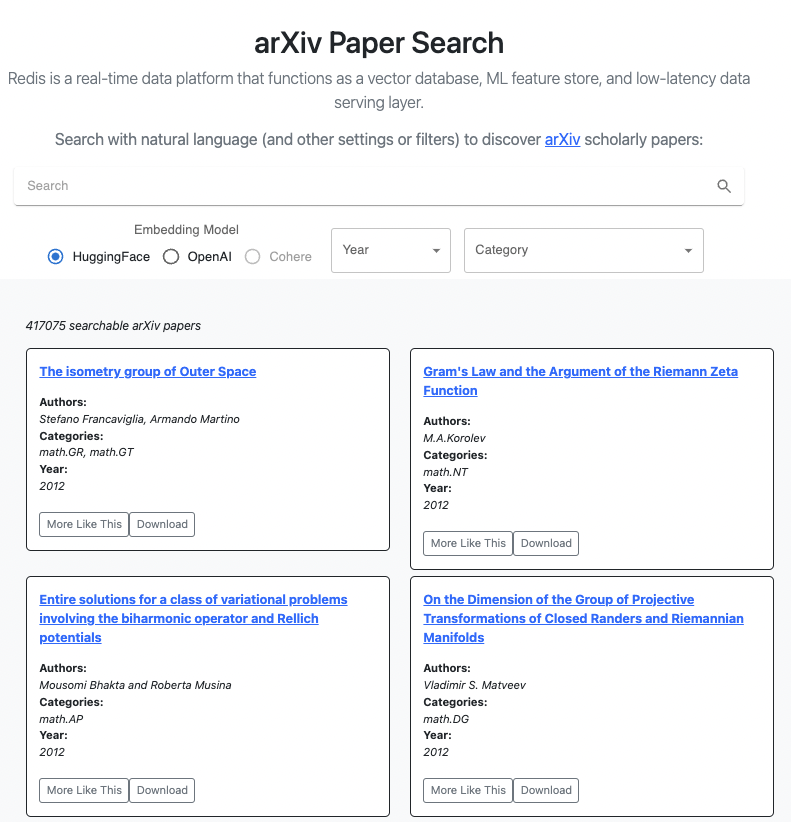

<div align="center">
    <a href="https://github.com/RedisVentures/redis-arXiv-search"></a>
    <br />
    <br />
<div display="inline-block">
    <a href="https://docsearch.redisvl.com"><b>Hosted Demo</b></a>&nbsp;&nbsp;&nbsp;
    <a href="https://github.com/RedisVentures/redis-arXiv-search"><b>Code</b></a>&nbsp;&nbsp;&nbsp;
    <a href="https://datasciencedojo.com/blog/ai-powered-document-search/"><b>Blog Post</b></a>&nbsp;&nbsp;&nbsp;
    <a href="https://redis.io/docs/interact/search-and-query/advanced-concepts/vectors/"><b>Redis Vector Search Documentation</b></a>&nbsp;&nbsp;&nbsp;
  </div>
    <br />
    <br />
</div>

# 🔎 Redis arXiv Search
*This repository is the official codebase for the arxiv paper search app hosted at: **https://docsearch.redisvl.com***

[Redis](https://redis.com) is a highly performant, production-ready vector database, which can be used for many types of applications. Here we showcase Redis vector search applied to a document retrieval use case. Read more about AI-powered search in [the technical blog post](https://datasciencedojo.com/blog/ai-powered-document-search/) published by our partners, *[Data Science Dojo](https://datasciencedojo.com)*.

### Dataset

The arXiv papers dataset was sourced from the the following [Kaggle link](https://www.kaggle.com/Cornell-University/arxiv). arXiv is commonly used for scientific research in a variety of fields. Exposing a semantic search layer enables natural human language to be used to discover relevant papers.




## Application

This app was built as a Single Page Application (SPA) with the following components:

- **[Redis Stack](https://redis.io/docs/stack/)** for vector database
- **[RedisVL](https://redisvl.com)** for Python vector db client
- **[FastAPI](https://fastapi.tiangolo.com/)** for Python API
- **[Pydantic](https://pydantic-docs.helpmanual.io/)** for schema and validation
- **[React](https://reactjs.org/)** (with Typescript)
- **[Docker Compose](https://docs.docker.com/compose/)** for development
- **[MaterialUI](https://material-ui.com/)** for some UI elements/components
- **[React-Bootstrap](https://react-bootstrap.github.io/)** for some UI elements
- **[Huggingface](https://huggingface.co/sentence-transformers)**, **[OpenAI](https://platform.openai.com)**, and **[Cohere](https://cohere.com)** for vector embedding creation

Some inspiration was taken from this [Cookiecutter project](https://github.com/Buuntu/fastapi-react)
and turned into a SPA application instead of a separate front-end server approach.

### Embedding Providers
Embeddings represent the semantic properies of the raw text and enable vector similarity search. This applications supports `HuggingFace`, `OpenAI`, and `Cohere` embeddings out of the box.

| Provider        | Embedding Model           | Required?  |
| ------------- |-------------| ----- |
| HuggingFace      | `sentence-transformers/all-mpnet-base-v2` | Yes |
| OpenAI      | `text-embedding-ada-002`      |   Yes |
| Cohere | `embed-multilingual-v3.0`      |    Yes |

**Interested in a different embedding provider?** Feel free to open a PR and make a suggested addition.

**Want to use a different model than the one listed?** Set the following environment variables in your `.env` file (see below) to change:

- `SENTENCE_TRANSFORMER_MODEL`
- `OPENAI_EMBEDDING_MODEL`
- `COHERE_EMBEDDING_MODEL`


## 🚀 Running the App
1. Before running the app, install [Docker Desktop](https://www.docker.com/products/docker-desktop/).
2. Clone (and optionally fork) this Github repo to your machine.
    ```bash
    $ git clone https://github.com/RedisVentures/redis-arXiv-search.git
    ```
3. Make a copy of the `.env.template` file:
    ```bash
    $ cd redis-arXiv-search/
    $ cp .env.template .env
    ```
    - Add your `OPENAI_API_KEY` to the `.env` file. **Need one?** [Get an API key](https://platform.openai.com)
    - Add you `COHERE_API_KEY` to the `.env` file. **Need one?** [Get an API key](https://cohere.ai)
4. Decide which Redis you plan to use, choose one of the methods below
    - **[Redis Stack](#redis-stack-docker)** runs Redis as a local docker container.
    - **[Redis Cloud](#redis-cloud)** will manage a Redis database on your behalf in the cloud.

### Redis Stack Docker (Local)
Using Redis Stack locally doesn't require any additional steps. However, it will consume more resources on your machine and have performance limitations.

Use the provided `docker-compose` file for running the application locally:
```bash
$ docker compose -f docker-local-redis.yml up
```


### Redis Cloud

1. [Get a FREE Redis Cloud Database](https://redis.com/try-free/). Make sure to include the Search module.

2. Add the `REDIS_HOST`, `REDIS_PASSWORD`, and `REDIS_PORT` environment variables to your `.env` file.

3. Run the App:
    ```bash
    $ docker compose -f docker-cloud-redis.yml up
    ```


## Customizing (optional)
- You can use the provided Jupyter Notebook in the [`data/`](data/README.md) directory to create paper embeddings and metadata. The output JSON files will end up stored in the `data/` directory and used when creating your own container.
- Use the `./build.sh` script to build your own docker image based on the application source code and dataset changes.
- If you want to use K8s instead of Docker Compose, we have some [resources to help you get started](k8s/README.md).

### React Dev Environment
It's typically easier to build front end in an interactive environment, testing changes in realtime.

1. Deploy the app using steps above.
2. Install packages (you may need to use `npm` to install `yarn`)
    ```bash
    $ cd frontend/
    $ yarn install --no-optional
    ````
4. Use `yarn` to serve the application from your machine
    ```bash
    $ yarn start
    ```
5. Navigate to `http://localhost:3000` in a browser.

All changes to your frontend code will be reflected in your display in semi realtime.


### Troubleshooting
Every once and a while you need to clear out some Docker cached artifacts. Run `docker system prune`, restart Docker Desktop, and try again.

This project is maintained by Redis on a good faith basis. Please, open an issue here on GitHub and we will try to be responsive to these.
